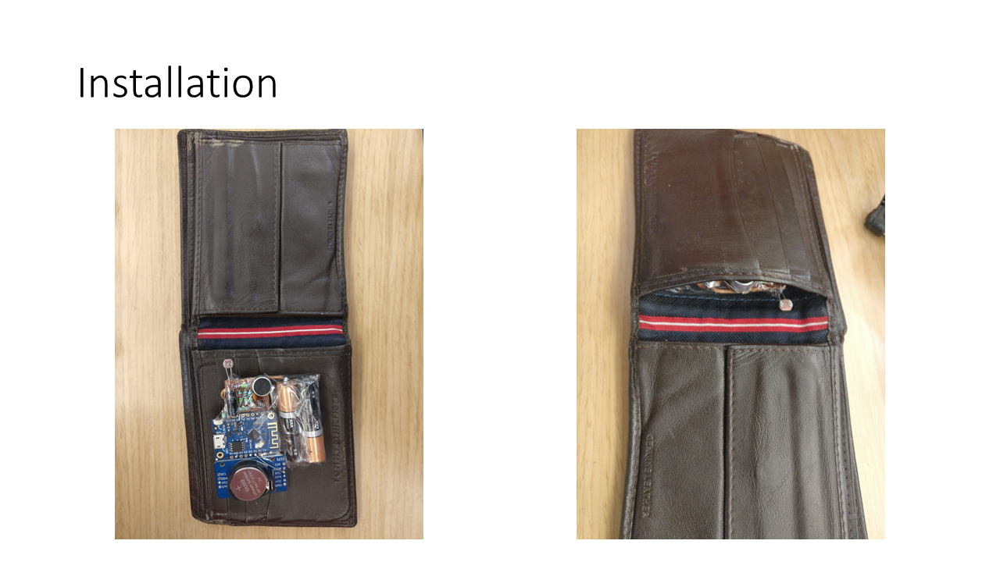

# Wallet Open Reporter

Simple IoT project that demonstrates the possibility of keeping track of cash transactions directly out of your wallet.

## How it works

This device is paired with your home wifi, and installed in your wallet.

Now imagine you are in a traditional Indian vegetable market. You probably move from vendor to vendor to get your vegetables/fruits. At one vegetable vendor, you purchased 1kg tomatoes, and you need to make a payment of Rs. 25/-. So you open your wallet. The device detected a change in the ambient light and starts a 5 second voice recording. You can say "Taking out Rs 25 for tomatoes", take the money out, and close the wallet after paying the vendor.

This way it takes a voice note of the transaction. You can do many such transactions for the duration of this visit.

Once you reach home, wallet connects to home wi-fi, all the voice notes are uploaded to an app, which does a speech to text conversion of the voice note. Now each voice note is listed along with their corresponding open-times with the transcribed voice notes.

## What has been done

In this prototype, when wallet is opened, light intensity change (Low to High) is detected using a LDR (Light dependent resister; this was a simpler implementation, otherwise any other suitable mechanical switch or sensor can be used) and it activates a simple amplified mic to record raw audio (without wav header to save space) data onto an esp8266 chip. This chip, when connects to its server on home wi-fi network, uploads the raw data and server saves them as wav file. When the report viewer app queries (HTTP GET) the server, list of voice notes with transcripts of the voice not is shown in tabular form along with the timestamp of each transaction.

## Where it may go

This is a base on which other IoT idea's can be merged to make your wallet a mighty one. Like, analyzing the transcripts we can get categorized spend. A GPS module can pinpoint the place and can figure out the probable place of spend. Also can be used to track the wallet's location in case its misplaced. And it can be used to keep track of your card swipe, of course through your voice note, so you get a report of your spend on cards before your monthly bill comes or without login to each cards' online banking. Possibilities are limitless.

## Components

* ESP8266 (Wemos D1 mini)
* Microphone electret amplifier circuit (manually built) - [Circuit Diagram](./imgs/schematic_mic_amp.png)
* RTC clock (DS3231)
* Two AAA battries
* Software
  * express app with a file upload library (check package.json file)
  * google speech-to-text engine (Requires configuration)

## High-level schematic

## Getting started

* We have only provided a `voicenotewallet.sample.json`. This is only a template. You have to create an actual google service account, and, enable the speech-to-text service. This is normally chargeable since you are creating a google cloud account. The services as part of creating such a profile are free for year, or, until a limiting amount (as of today). Rename the file to `voicenotewallet.json`.
* Start the express server
* For the ESP8266 we need to flash the chip with your home wifi, password, and, the ip of your server running the above express app. Power the device.

Now this should be usable.
